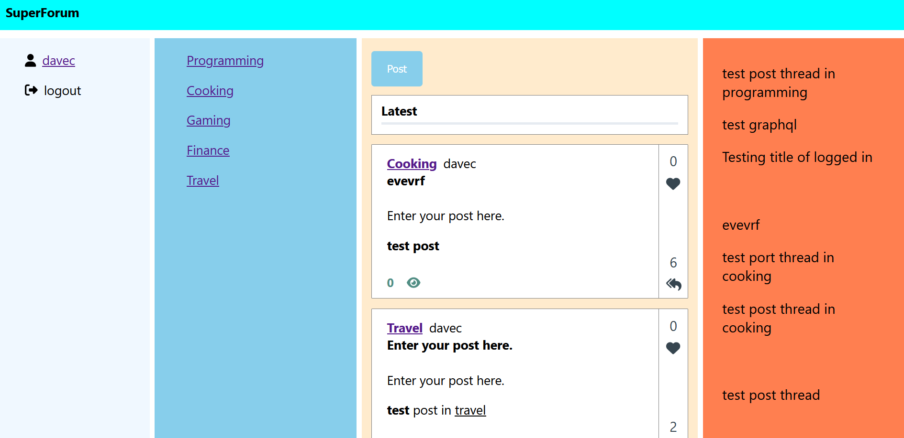
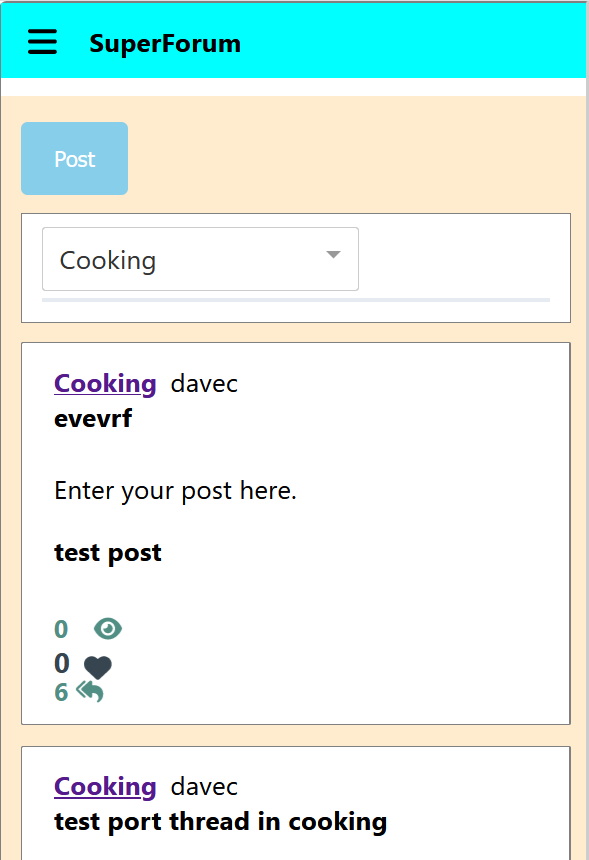

> [!NOTE]
> 全栈论坛学习项目，功能包括用户注册，登录验证，帖子发布，评论帖子；:grinning:
> 技术栈：React + Redux + Express + Postgres + Graphql

> [!IMPORTANT]
> 功能有待完善: :thinking:
>
> - [ ] 评分系统，点赞转发分享
>
> - [ ] 富文本格式支持
>
> - [ ] 网站性能优化

> [!IMPORTANT]
> 截图：
> 
> 

